<!--
IRIDESCENT OBSIDIAN · GLASS EDITION
Before pushing, replace YOUR_RESUME_URL below with the final public resume URL.
GitHub username used throughout: Amish-Sudhakara
-->

 

 

  

  

<picture>
  <source media="(prefers-color-scheme: dark)" srcset="https://raw.githubusercontent.com/Amish-Sudhakara/Amish-Sudhakara/output/orb-contribution-snake.svg" />
  <source media="(prefers-color-scheme: light)" srcset="https://raw.githubusercontent.com/Amish-Sudhakara/Amish-Sudhakara/output/orb-contribution-snake.svg" />
  
</picture>

 

  

